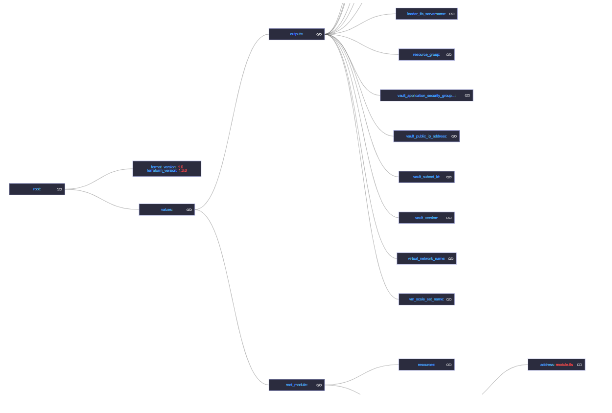

# My Project Title

Welcome to My Project! This document provides all the necessary instructions to install and run the application. If you encounter any issues or have questions, please refer to the contact section at the end of this document.

## Prerequisites

Before proceeding, ensure you have Node.js installed on your system. If not, download and install it from [Node.js Official Website](https://nodejs.org/).

## Installation

This project uses the `serve` package to run the application locally. First, you need to install `serve` globally using npm (Node Package Manager). Open your terminal and run the following command:

```bash
npm install -g serve
```

## Run the application

```
serve --single
```



